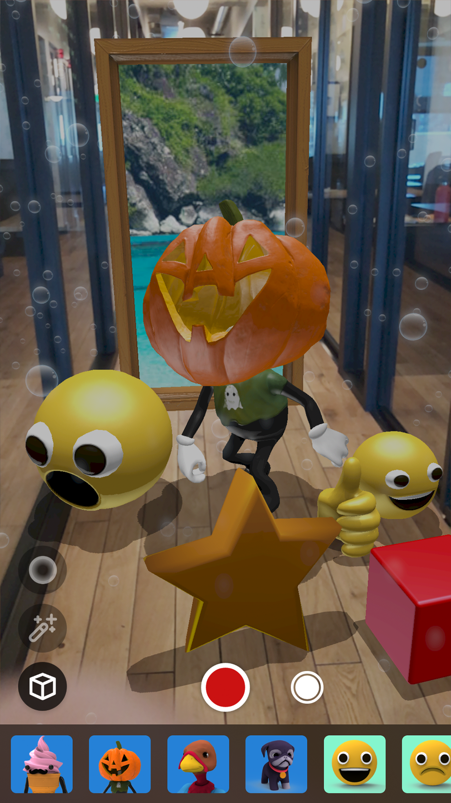

# Viro React
Viro React is a platform for developers to rapidly build augmented reality (AR) and virtual reality (VR) experiences. Developers write in React Native, and Viro runs their code natively across all mobile VR (including Google Daydream, Samsung Gear VR, and Google Cardboard for iOS and Android) and AR (iOS ARKit and Android ARCore) platforms. [More info here](http://docs.viromedia.com/).

This project contains various sample Viro projects.

The platform is free to use with no limits on distribution.

To report bugs/issues with Viro platform, please file new issues on this repository.

## Instructions for running sample projects using Testbed app:

1. Follow directions on our [Quick start guide](https://docs.viromedia.com/docs/quick-start) to setup dependencies for trying these sample projects with the Viro Media App.
2. Clone the repo into your workspace with git: `git clone https://github.com/viromedia/viro.git`.
3. Go into the code-samples directory.
4. Run `npm install` from the root of this project.
5. Run `npm start` from the root of this project.
6. Open the Viro Media App, slide out the left panel and select "Enter Testbed".
7. Type the entire ngrok URL output (xxxxxx.ngrok.io) at the top of the terminal into the text field and hit 'GO'
8. You should now be in the application! Enjoy!

## Instructions for running sample code as a stand alone project (with no Testbed app):
Tried the samples through our Testbed app and now want to try deploying sample code to your device as standalone apps? These quick steps below should get you started:
1. Follow steps 1 - 4 from above (instructions for using with Testbed app)
2. For Android, make sure you have downloaded and installed Android Studio from [here](https://developer.android.com/studio/install) to get required SDK and platform-tools for building android apps
    Make sure you have the required environment variables set - `$ANDROID_HOME`, and added `platform-tools` to `$PATH` variable. If not,
    ```
    export ANDROID_HOME=/YOUR_PATH_TO/Android/sdk
    export PATH=$ANDROID_HOME/platform-tools:$PATH
    export PATH=$ANDROID_HOME/tools:$PATH
    ```
    Build and launch android app by executing the following from the root of the project
    ```
    react-native run-android --variant=gvrDebug
    ```
3. For iOS, in Xcode open `ViroSample.xcworkspace` in `ios/` directory.
    Select the right "Team" for `ViroSample` and `ViroSampleTest` target under `General -> Signing`
    Hit play to build and launch the app on your iOS device

## Changing Between Samples

1. Open App.js in a text editor.
2. For AR, set showARScene=true at line 44.
3. For VR, Modify line 61: `scene: scenes['360 Photo Tour'],` to a scene defined in the `scenes` dictionary on line 30.
3. Reload/restart the application.

## More information

Check out our [website](http://www.viromedia.com/).

Look at our [documentation](http://docs.viromedia.com/).

Join our Slack group [here](https://join.slack.com/t/virodevelopers/shared_invite/enQtMzI3MzgwNDM2NDM5LTBiOTRkMDg0Zjc0ODIyYTAxZDczYzFmODJhMDUxZjVhOTk0NGVhMjNlZTY0ZjkxNjMzZGEyNDNlYzc4ZTkzNzQ).

## Sample Code

### [Figment AR (Complete Open Source App)](https://github.com/viromedia/figment-ar)
A repository containing the entire source code, built using ViroReact and React Native, for Viro Media's award winning Figment AR App. Available on [Google Play](https://play.google.com/store/apps/details?id=com.viro.figment) and [App Store](https://itunes.apple.com/us/app/figment-ar/id1270018902?mt=8).

<a href="https://github.com/viromedia/figment-ar">   </a>

#### Download complete source at https://github.com/viromedia/figment-ar

### Sample Code Overview

A scene with a 360 photo that displays "Hello World".

### [360 Photo Tour](https://github.com/viromedia/viro/tree/master/code-samples/js/360PhotoTour)

<a href="https://github.com/viromedia/viro/tree/master/code-samples/js/HelloWorld">

</a>

360 photo tour example that shows you how to display a 360 photo with clickable hot spots.

### [Human Body](https://github.com/viromedia/viro/tree/master/code-samples/js/HumanBody)

<a href="https://github.com/viromedia/viro/tree/master/code-samples/js/HumanBody">

</a>

This example showcases 3d objects. Orbit around a 3d Heart to see it from different angles!

### [VR MediaPlayer](https://github.com/viromedia/viro/tree/master/code-samples/js/ViroMediaPlayer)

<a href="https://github.com/viromedia/viro/tree/master/code-samples/js/ViroMediaPlayer">

</a>

Learn how to display and play 2d and 360 video with interactive play controls that can play, pause and stop.

### [Product Showcase](https://github.com/viromedia/viro/tree/master/code-samples/js/ProductShowcase)

<a href="https://github.com/viromedia/viro/tree/master/code-samples/js/ProductShowcase">

</a>

Learn how to display and play 2d and 360 video with interactive play controls that can play, pause and stop.
A demonstration on how to do an interactive shopping app for TV's. Uses flexbox for UI and 3d objects with animations.

### [AR Sample](https://github.com/viromedia/viro/tree/master/code-samples/js/ARSample)

<a href="https://github.com/viromedia/viro/tree/master/code-samples/js/ARSample">

</a>

A scene with objects, text and animation displayed on ARKit planes detected in the scene.

### [AR Car Marker Demo](https://github.com/viromedia/viro/tree/master/code-samples/js/ARCarDemo)

<a href="https://github.com/viromedia/viro/tree/master/code-samples/js/ARCarDemo">

</a>

An ARScene that looks for this [image](https://github.com/viromedia/viro/tree/master/code-samples/js/ARCarDemo/res/logo.png) and adds a model of a car with the ability to change its colors.

### [AR Driving Car Demo](https://github.com/viromedia/viro/tree/master/js/ARDrivingCarDemo)

<a href="https://github.com/viromedia/viro/tree/master/js/ARDrivingCarDemo">

</a>

An ARScene that lets the user place a car on a surface and drive it around the world. See instructions in the project directory to enable the demo.

### [AR Poster Demo](https://github.com/viromedia/viro/tree/master/code-samples/js/ARPosterDemo)

<a href="https://github.com/viromedia/viro/tree/master/code-samples/js/ARPosterDemo">

</a>

An ARScene that searches for this vertical [marker](https://github.com/viromedia/viro/tree/master/code-samples/js/ARPosterDemo/res/blackpanther.jpg) and renders Black Panther jumping out of the marker.

### [AR Tracking Business Card Demo - iOS Only](https://github.com/viromedia/viro/tree/master/code-samples/js/ARBusinessCard)
<a href="https://github.com/viromedia/viro/tree/master/code-samples/js/ARBusinessCard">

</a>

An ARScene that tracks this [business card](https://github.com/viromedia/viro/blob/master/code-samples/js/ARBusinessCard/res/business_card.png) continously using image tracking.

### [AR Full Sample App](https://github.com/viromedia/ViroARSampleApp)
A complete React Native w/Viro AR Sample App. Demonstrates how to place, drag, and scale objects in the real world while providing 2D UI feedback.

<a href="https://github.com/viromedia/ViroARSampleApp">

</a>

## Tutorials

### [How to build an interactive AR app in 5 minutes](https://blog.viromedia.com/how-to-build-an-interactive-ar-app-in-5-mins-w-react-native-viro-ar-e420147e1612)

<a href="https://blog.viromedia.com/how-to-build-an-interactive-ar-app-in-5-mins-w-react-native-viro-ar-e420147e1612">

</a>

### [How to build AR Portals in 5 minutes](https://blog.viromedia.com/how-to-build-ar-portals-in-5-mins-w-react-native-viro-ar-b939850def94)

<a href="https://blog.viromedia.com/how-to-build-ar-portals-in-5-mins-w-react-native-viro-ar-b939850def94">

</a>

### [Add Snapchat-like AR Lenses to any app](https://blog.viromedia.com/add-snapchat-ar-lenses-to-any-app-w-react-native-viro-ar-9d4053769782)

<a href="https://blog.viromedia.com/add-snapchat-ar-lenses-to-any-app-w-react-native-viro-ar-9d4053769782">

</a>

